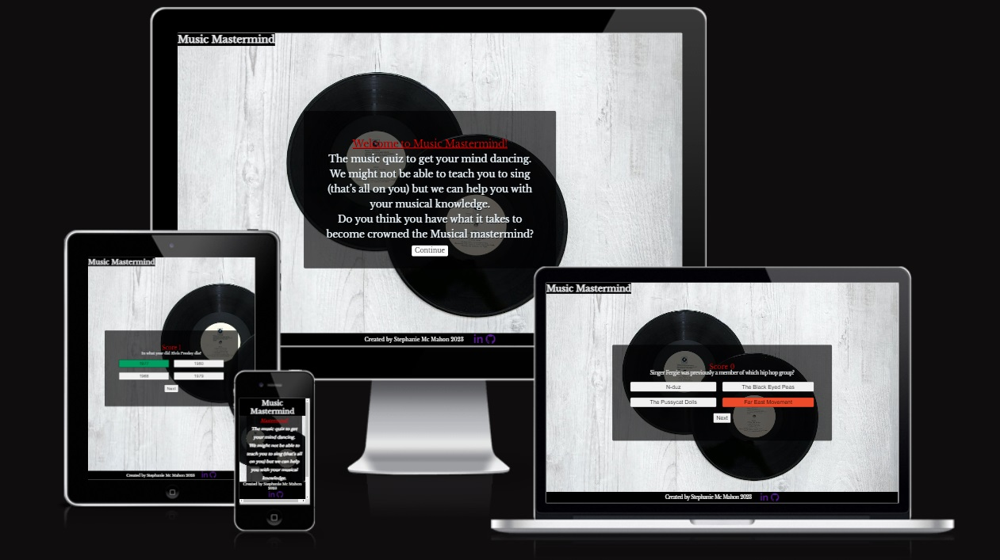

# Music Mastermind
[View Website Here](https://stefka92.github.io/MusicQuiz/)

Music Mastermind is an online music quiz  created to test your music knowledge throughout all different musical genres. The idea for the quiz arose from my love of music and pub quizzes.  The quiz will be comprised of 10 random music related questions all ranging from different genres.
This website will be targeted towards any one with an interest in different types of music and are looking to test out their musical knowledge just for fun.

The aim of this project was to build a responsive website/game using HTML, CSS and JavaScript. The website is responsive on mobile phones, tablet and desktop.

This website was created for educational purposes only.

In addition to the home page the website also features:

- The 'Begin' page;
- The `Quiz`.

The business goals for the website are;

- To provide an interactive website.
- To provide a fun and light hearted quiz.
- To allow customers to test their musical knowledge.
- To activate the brain to keep you young.
- To be able to view the website on a range of different device sizes.

The Users Goals of the website are;

- As a first time user, to be able to navigate the website easily.
- As a first time user, to have a clear understanding as to what the quiz is about.
- As a first time user, to allow the user to be able to complete the quiz without any issues.
- As a recurring or first-time visitor, to be able to restart the quiz and try beat their previous score.
- As a recurring or first-time visitor to be able to view their final score.

## Strategy

### Considering the core UX principles.

I first had to think about who my target audience would be and what would keep it simple and straightforward for them. As music pays a huge part in many people lives I felt it was a good topic to go with as it would attract a wide range of users. I decided to keep the website minimal, clutter free so that it didnt take away from the main aim of the website which is to provide a simple interactive quiz .

Music Mastermind target users are:

- All ages.
- All genders.
- People interested in Music.
- Open minded people willing to try new experiences.
- People looking to activate their brain and test their music knowledge.

What these users would be looking for:

Easy to navigate website with clear straightforward information.
-  Clear and consise questions.
- Multiple choice answered.
- A score tracker so their final result is calculated.

## Scope
As this is my is my first time working with JavaScript, I decided to keep the quiz very simple.
In order to meet the above criteria, the following features will be included in the website
- A Header when clicked will take you back to the home page
- Quiz Section containing multiple choice questions and answers
- Social network links
- A music image to go with the theme
- Control buttons to navigate the quiz

## Structure

## Skeleton
 
Please note the actual website has changed Since these wireframes. During the building process I decided to Change the content on the home page from displaying the rules to a more fun approach instead. I had originally planned on having a timer but this didn't workout within the allocated time frame.

**Home Wireframe**

**About Wireframe**

**Sign-up Wireframe**

## Surface
The website uses a simple color scheme consisting of neutral tones. The background image contains 2 music records in black which are sitting on a grey floor so I carried this throughout the website. The heading text is the same grey as the background and the color around the heading is black to compliment the music records. The container which displays the questions and answers is on a transparent background so that the music records are still visible. The color palette was created using the https://coolors.co/ website.

I used Google fonts “Marher” throughout the website as after trialing several different fonts I found this one stood out the most as it was clear and still ledable on smaller devices.

## Features

**Header & Navigation**

**Footer**

**About paragraph & image**

**About schedule**

**Sign-up form**

Th

**Thank you message & button**

 
### Languages Used
HTML - Used as the basic building block for the project and to structure the content.
CSS - Used to style the web content.

## Frameworks, Libraries & Programs Used

https://lucid.app/ - Used to create wireframes.

[Git](https://git-scm.com/) - For version control.

[Github](https://github.com/) - To save and store the project files for the website.

[Gitpod](https://gitpod.io/workspaces) - Used to deploy the website.

[Google Fonts](https://fonts.google.com/specimen/Open+Sans) - To import the fonts used on the website.

[Font Awesome](https://fontawesome.com/) - For the icons used on the website.

[Google Dev Tools](https://www.google.com/chrome/dev/) - Used to test styles and fix features within the website.

[Pexels](https://www.pexels.com/) - Used to access and download free images for the website.

[Coloors](https://coolors.co/) - Used to create a colour palette for the design.

[Am I Responsive](https://ui.dev/amiresponsive) -To view the website image on a range of different devices.

[freeformatter](https://www.freeformatter.com/html-formatter.html#before-output) - Used to format my HTML.

[CSS formatter](https://formatter.org/css-formatter) -Used to format my CSS
 
### Deployment
Github Pages was used to deploy the live website. The instructions to achieve this are below:
1. Log in (or sign up) to Github.
2. Find the repository for this project,Periwinkle Pilates.
3. Click on the Settings link.
4. Scroll down to Pages on the left hand side of the navigation bar and click on this link.
6. In the Source section, choose main from the drop down select branch menu. Select Root from the drop down select folder menu.
7. Click Save. Your live Github Pages site is now deployed at the URL shown (This may take a few minutes to show up).

**How to Fork**
If you would like to make changes to this repositiry without affecting the original you can do so by making a copy.
1. Click the GitHub repository you wish to fork.
2. Click on the fork button located in the top right hand corner.

 **How to clone**
If you would like to download this repository and store it locally you can do so by cloning it
1.Click the GitHub repository Periwinkle Pilates.
2.Click on the drop down arrow on the Code button located on the top right.
3.Select and copy the link that appears.
4.Open Gitpod & select the location where you would like the clone to be saved.
5.In the terminal type 'git clone' and paste the link.
6.Press enter to create your local clone.

 
## Testing
To test my website I went through the following tests:
I carried out each test using different browsers which included google chrome, firefox and microsoft.

**Links**
1. Test each link on the index page which included the Header link, the navigation links, the find out more button and both social media links which opened in separate tabs.
2. Test each link on the About page which included the Header link, the navigation links, and both social media links which opened in separate tabs.
3. Test each link on the Sign-up page which included the Header link, the navigation links, the sign up now button and both social media links which opened in separate tabs.

**Form**
1. Test the form leaving out the First name.I  tried to fill out the form leaving out the first name, when I tried to click the sign up now button. The error message appeared stating that I had to fill in the First Name
2. Test the form leaving out the Last name.I  tried to fill out the form leaving out the Last name, when I tried to click the sign up now button. The error message appeared stating that I had to fill in the Last Name.
3. Test the form leaving out the Email.I  tried to fill out the form leaving out the Email address, when I tried to click the sign up now button. The error message appeared stating that I had to fill in the Email address.
4.Test the form leaving out the Date of birth.I  tried to fill out the form leaving out the Date of Birth, when I tried to click the sign up now button. The error message appeared stating that I had to fill in the Date of Birth.
5.Test the form leaving out the contact number. I  tried to fill out the form leaving out the contact number, when I tried to click the sign up now button. The error message appeared stating that I had to fill in the Contact Number.

### Lighthouse testing
 
I used Lighthouse on google chrome to test the performance, accessibility, best practices and seo.

**Home page**

**Sign up page**

 
### HTML and CSS Validation

I used W3C to test both my HTML and CSS

**Showing errors**

**passed**

## color.a11y.com
I used color.a11y to test my colour contrast. There was one contract issue and a recommendation to change the colors or else increase the font size so I went with increasing the font size 

 
 ## Credits
 
**Code Used**

- [Love Running](https://learn.codeinstitute.net/courses/course-v1:CodeInstitute+LR101+2021_T1/courseware/4a07c57382724cfda5834497317f24d5/c428cfb8fd5e4852bbba1f94e914b3b4/) I used the love running project as a guide line for creating my form section and schedule table.

- [Create a Responsive Webpage Layout for Phones and Tablets](https://www.youtube.com/watch?v=XTkDLeMy-7Q) I Used this youtube video as a guideline for creating my media queries.

- [Create a button](https://stackhowto.com/how-to-make-a-button-link-to-another-page-in-html/) I used stack how to as a guideline for creating my button.

- [Create a form](https://www.youtube.com/watch?v=E5MEzC0prd4) I used this youtube video as a guideline for creating my form.
 
**Content**

The majority of the content was written by Stephanie McMahon. 

I used [total fitness](https://www.totalfitness.co.uk/blog/fitness/what-is-pilates/) for the paragraph explaining what pilates is.

I followed Kera Cudmores template on how to create a readme and took inspiration from daisygunn.

**Media**

 - [all images throughout the website were downloaded from pexels](https://www.pexels.com/)
 - [the social media icons were taken from font awesome](https://fontawesome.com/)
 
## Acknowledgments

I would like to acknowledge the following people who helped me in completing this project:
- My Course Mentor Harry Dhillon for his support and guidance.
- My friends Sinead Griffin & Geraldine Rynne for testing my site, providing feedback and ensuring all links were working.
- Aine Hurley for helping come up with a name for my website.

 
 
